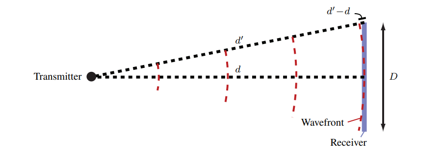
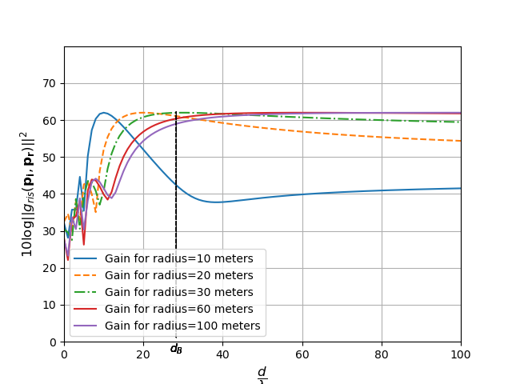
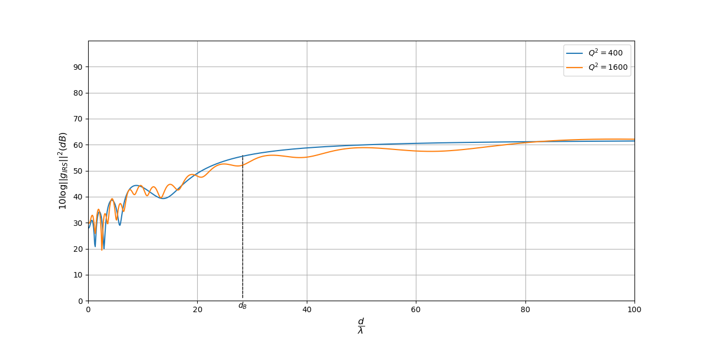
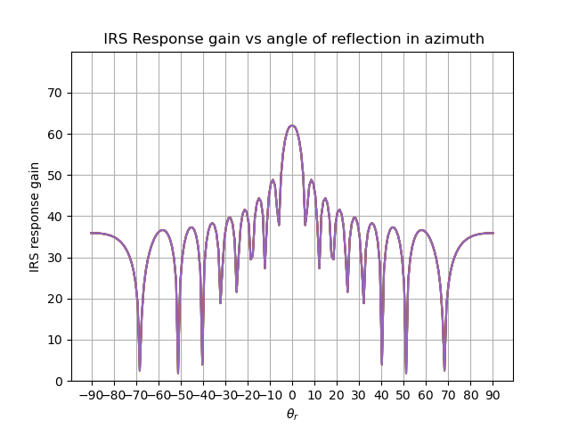

# IRS Codebook Design under Hardware Considerations

Near-field codebook design for Intelligent Reflecting Surfaces (IRS), extending a
far-field linear phase-shift codebook to the near field and evaluating it under
realistic hardware constraints — discrete, PIN-diode-limited phase shifts, phase
errors, and phase noise.

[]()
[](LICENSE)

## Overview

Intelligent Reflecting Surfaces (IRS), also called Reconfigurable Intelligent
Surfaces (RIS), are artificial surfaces made of a large number of passive,
reconfigurable scattering elements. Each element applies a phase shift to an
impinging electromagnetic wave without amplifying it; by controlling the phase
shift of every element, the superposed reflections from the whole surface can be
steered toward a target. This gives wireless systems an extra, controllable
propagation path — particularly useful at high carrier frequencies (mmWave), where
a blocked line-of-sight would otherwise cause severe attenuation.

Computing the optimal phase shift for every element online, for every user,
requires channel state information that is expensive to acquire for a surface with
hundreds of elements. A common alternative is a *codebook*: a set of phase-shift
configurations designed offline and selected online from coarse information about
the user's direction or location, avoiding per-element channel estimation. In
practice, however, an IRS unit cell cannot realize an arbitrary continuous phase
shift — hardware such as PIN-diode-tuned copper patches only supports a small
number of discrete phase states, and the achieved phase is noisy. A codebook that
looks good in a continuous-phase model can degrade substantially once these
constraints are taken into account.

This project reviews far-field codebook designs from the literature (DFT, linear,
and quadratic phase-shift codebooks), works out when an IRS with many elements
stops being well described by the far-field (planar-wave) assumption using the
Fraunhofer, Fraunhofer-array, and Björnson distance criteria, and then proposes a
near-field extension of the linear codebook: a phase-shift design computed directly
from the geometric distances between the transmitter, every IRS unit cell, and
points on a spherical target grid, rather than from angle-of-arrival/departure
alone. It then implements this near-field codebook with N-bit discrete phase
quantization (emulating a fixed number of PIN diodes per element) and studies how
the resulting beam pattern degrades under quantization, uniform phase error, and
additive Gaussian phase noise, averaged over repeated realizations.

## Methodology / Approach

- **Far-field baseline.** DFT, linear, and quadratic phase-shift codebook designs
  (following Jamali et al.) are implemented as a reference. Each defines a per-element
  phase shift as a function of the element index and a codeword index, and the
  resulting IRS response gain is evaluated from planar-wave angle-of-arrival /
  angle-of-departure steering vectors.
- **Near/far-field boundary.** The Fraunhofer distance, the Fraunhofer *array*
  distance for extremely large antenna arrays, and the Björnson distance (the point
  beyond which IRS reflection gain saturates, per Ramezani & Björnson) are derived
  and computed for an example IRS. For a 400-element (20×20) surface spanning
  10λ×10λ, the report finds a normalized Björnson distance of ≈28.3λ against a
  Fraunhofer array distance of 400λ — more than an order of magnitude apart —
  illustrating why a realistic mmWave IRS deployment can easily fall in the near
  field even though the classical far-field criterion has not yet been reached.
- **Near-field codebook (this project's extension).** The IRS, the transmitter, and
  the target are placed as explicit 3D position vectors; each unit cell's phase
  shift is set to the negative of the total path length from transmitter to that
  cell to a target point on a spherical grid (a matched-filter / beamfocusing
  design), and the resulting gain is evaluated against distance and angle rather
  than angle alone.
- **Hardware impairments.** The continuous phase design is then discretized to *b*
  bits (`mul = 2π / 2^b`), modeling a fixed number of PIN diodes per unit cell, and
  perturbed with (a) uniform phase error and (b) additive Gaussian phase noise.
  Beam patterns are compared for 1, 2, 3, and 10 bits, both for a single noise
  realization and averaged over 100 realizations, to separate systematic
  beam-shape distortion from random noise. The report's conclusion is that around
  3 bits (8 discrete phase states) already brings the beam pattern close to the
  continuous-phase case — a practical complexity/performance operating point.
- All of this is implemented as closed-form array-gain summations in plain NumPy
  (no channel simulator or convex solver); simulations use a 30 GHz mmWave carrier
  and, by default, a 20×20-element IRS.

<p align="center">
  
</p>

*Geometry behind the Fraunhofer distance: the extra path length d′ − d between the
wavefront reaching the center versus the edge of an aperture of size D determines
the classical near/far-field boundary used as one of the criteria above.*

## Key Results

<p align="center">
  
</p>

*Near-field codebook reflection gain (dB) vs. normalized distance d/λ from the IRS,
for target radii of 10, 20, 30, 60, and 100 m. Each curve peaks close to its own
target radius and all curves converge once the distance passes the Björnson
distance d_B — the phase-shift design focuses energy on the intended near-field
target point instead of just a far-field direction.*

<p align="center">
  
</p>

*Baseline for comparison: the far-field Linear codebook, evaluated with the
near-field gain formula, for two IRS sizes (Q² = 400 and 1600 elements). Without a
distance-aware phase design, gain simply grows with distance instead of peaking at
a target location — the gap this project's near-field extension addresses.*

<p align="center">
  
</p>

*Reflection gain vs. evaluation angle θr for a fixed user at 30 m, using the
continuous (unquantized) near-field phase-shift design: a clear main lobe toward
the target direction with the expected side-lobe structure.*

<p align="center">
  
  
</p>

*Effect of discrete, PIN-diode-limited phase quantization: reflection gain vs.
distance for a 10 m target with 1-bit (left) and 3-bit (right) phase resolution.
Going from 1 to 3 bits raises and smooths the achieved peak gain, approaching the
continuous-phase result — consistent with the report's conclusion that about 3
bits is a reasonable complexity/performance tradeoff for the PIN-diode count.*

Additional figures (angle sweeps, far-field validation plots, and further
distance sweeps) are included in `results/figures/` but not all are reproduced
here.

## Repository Structure

```
irs-codebook-design/
├── README.md
├── LICENSE                     MIT (code only — see License section)
├── .gitignore
├── src/                        Simulation code (NumPy + Matplotlib)
│   ├── Codebook_design.py              DFT / Linear / Quadratic far-field codebooks
│   ├── Codebook_design_1.py            earlier variant, angle-domain sweep
│   ├── extension_of_linear_codebook.py near-field codebook (core contribution)
│   ├── linear_codebook_extension.py    + discrete phase shifts / phase error
│   ├── linear_codebook_noise_beam.py   + averaged Gaussian noise, multi-bit sweep
│   └── near_field.py                   earlier aperture-mapping experiment
├── results/
│   ├── figures/                 Result plots (PNG)
│   └── data/                    Cached simulation outputs (.npy)
├── report/                      Final report + presentation (PDF)
├── references/                  Third-party literature (PDF) + references.md
├── notes/                       Raw project notes (initial ideas, working log)
└── docs/                        Project announcement (Aushang) + LaTeX source
```

## Getting Started

Requires **Python 3.8+** with:

```bash
pip install numpy matplotlib
```

No other dependencies are used — every script relies only on `numpy` for the
array/gain math and `matplotlib.pyplot` for plotting (`pdb` and `math` from the
standard library are used for ad hoc debugging/scratch code in places).

Each script under `src/` is self-contained and runs as a standalone simulation
that pops up a Matplotlib figure, for example:

```bash
python src/extension_of_linear_codebook.py
```

Note: the scripts save/load `.npy` caches with bare relative filenames (e.g.
`gain_q_20.npy`) in the directory they are run from, and several save/plot calls
are commented out from iterative development — uncomment as needed. The arrays
under `results/data/` are the author's original cached outputs, provided for
reference rather than wired up to these relative paths.

## Report & Presentation

- [`report/IRS_Codebook_Design_under_Hardware_Considerations.pdf`](report/IRS_Codebook_Design_under_Hardware_Considerations.pdf) —
  the full written report (introduction, near/far-field theory, far-field and
  near-field codebook designs, discrete phase shifts and hardware-impairment
  results, conclusion, bibliography).
- [`report/presentation.pdf`](report/presentation.pdf) — the accompanying slide
  deck.

## References

See [`references/references.md`](references/references.md) for the full literature
list (papers cited in the report, plus additional background reading from the
literature review), each linked to the corresponding PDF in `references/`.

## Author

**Aakarsh Dhariwal** — Friedrich-Alexander-Universität Erlangen-Nürnberg (FAU)

Research Internship at the Institute for Digital Communications (Lehrstuhl für
Digitale Übertragung), chaired by Prof. Dr.-Ing. Robert Schober (18 July – 18
October 2022; report submitted 11 January 2023).
Supervised by Moritz Garkisch and Ata Khalili.

## Citation

If you reference this work, please cite it as:

```bibtex
@software{dhariwal2023irs,
  author = {Dhariwal, Aakarsh},
  title  = {IRS Codebook Design under Hardware Considerations},
  year   = {2023},
  url    = {https://github.com/aakarshdhariwal/irs-codebook-design}
}
```

Machine-readable citation metadata is also available in
[`CITATION.cff`](CITATION.cff).

## License

The code in `src/` is released under the [MIT License](LICENSE). The report, the
presentation, and the third-party papers under `references/` retain their
original copyright and are included for academic context only — they are not
covered by the MIT license.
